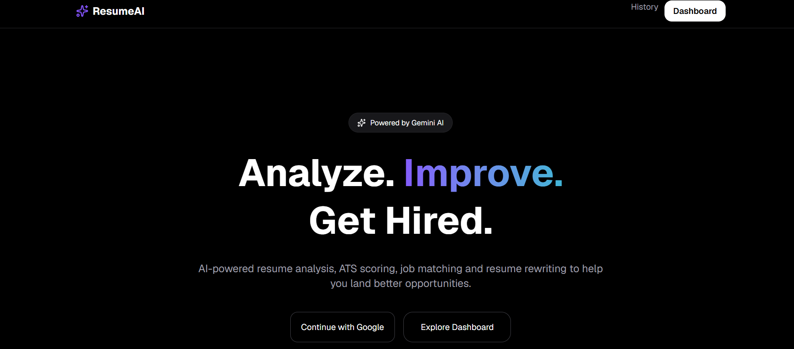
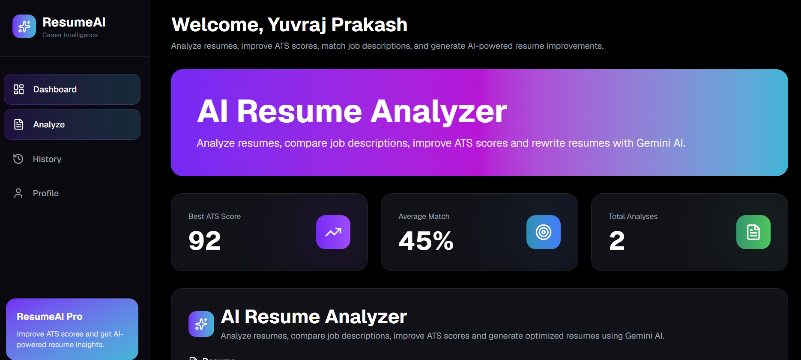
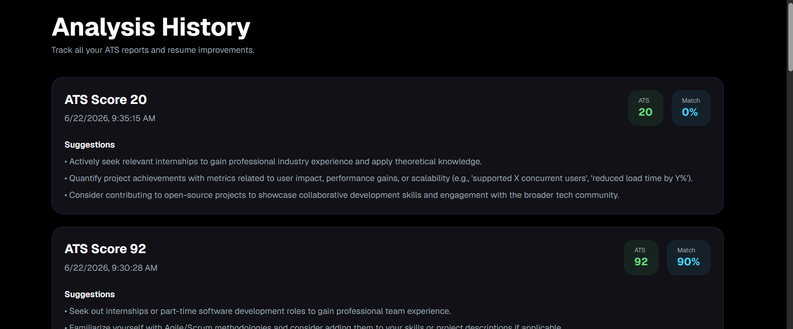
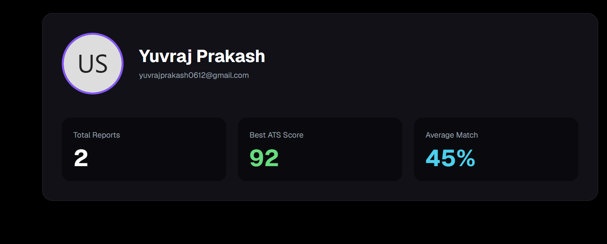

# ResumeAI

<div align="center">

### AI-Powered Resume Analyzer & ATS Optimizer

Analyze resumes, compare them against job descriptions, improve ATS compatibility, and generate ATS-friendly LaTeX resumes using Google Gemini AI.

**Live Demo:** https://ai-resume-analyzer-52.vercel.app

</div>

---

## Overview

ResumeAI is a full-stack AI application that helps job seekers optimize their resumes for Applicant Tracking Systems (ATS).

The application analyzes resumes, compares them with job descriptions, provides actionable feedback, identifies missing skills, suggests important keywords, and generates an ATS-friendly LaTeX version of the resume.

---

## Features

* Google Authentication (Auth.js)
* ATS Score Analysis
* Job Description Matching
* Resume Strength & Weakness Analysis
* Missing Skills Detection
* Keyword Recommendations
* AI Resume Suggestions
* PDF Resume Upload (drag & drop, auto-parsed)
* ATS Report Export (PDF)
* ATS-Friendly LaTeX Resume Generation (Pro)
* Resume Analysis History (per-account, private)
* Free / Pro Plans with Monthly Usage Limits
* Pricing Page & Upgrade Flow
* Responsive Dashboard
* Modern UI with Tailwind CSS

---

## Tech Stack

### Frontend

* Next.js 16
* React 19
* Tailwind CSS
* Framer Motion
* Lucide React

### Backend

* Next.js App Router
* MongoDB Atlas
* Mongoose
* Auth.js

### AI

* Google Gemini 2.5 Flash

### Deployment

* Vercel

---

## Screenshots

### Landing Page

<p align="center">

</p>

---

### Dashboard

<p align="center">

</p>

---

### Analysis History

<p align="center">

</p>

---

### User Profile

<p align="center">

</p>

---

## Installation

Clone the repository

```bash
git clone https://github.com/Yuvraj2005-commits/AI-resume-analyzer.git
```

Move into the project

```bash
cd ai-resume-analyzer
```

Install dependencies

```bash
npm install
```

Run the development server

```bash
npm run dev
```

Open:

```
http://localhost:3000
```

---

## Environment Variables

Create a `.env.local` file.

```env
GOOGLE_GENERATIVE_AI_API_KEY=

AUTH_SECRET=

AUTH_GOOGLE_ID=
AUTH_GOOGLE_SECRET=

MONGODB_URI=

NEXTAUTH_URL=http://localhost:3000
```

> No Stripe/payment keys are required — the Pro plan is currently a functional
> usage-gated freemium flow (see [Plans & Billing](#plans--billing)), not live
> payment collection.

---

## Project Structure

```
src/
│
├── app/
│   ├── api/
│   ├── dashboard/
│   ├── history/
│   ├── profile/
│   └── rewrite/
│
├── components/
│   ├── dashboard/
│   └── ui/
│
├── lib/
│
├── models/
│
└── auth.ts
```

---

## AI Analysis Includes

* ATS Score
* Job Match Percentage
* Strengths
* Weaknesses
* Resume Suggestions
* Missing Skills
* Keyword Recommendations
* ATS-Friendly LaTeX Resume Generation

---

## Plans & Billing

ResumeAI ships with a real (not cosmetic) freemium model:

* **Free** — 3 resume analyses per calendar month, full ATS report, PDF export.
* **Pro** — unlimited analyses + AI LaTeX resume rewrites.

Usage is tracked per account from existing `Analysis` records (`src/lib/plans.ts`)
and enforced server-side in `POST /api/analyze` and `POST /api/rewrite`. There's
no payment processor wired up yet, so "Upgrade to Pro" on `/pricing` captures an
upgrade request (`UpgradeRequest` model) instead of charging a card — swap that
for real Stripe Checkout once API keys are available.

## Future Improvements

* Stripe Checkout for real Pro billing
* DOCX Resume Support
* Cover Letter Generator
* Resume Templates
* Multiple Resume Management
* LinkedIn Profile Analysis
* AI Interview Preparation

---

## Author

**Yuvraj Prakash**

GitHub: https://github.com/Yuvraj2005-commits

LinkedIn: https://linkedin.com/in/yuvraj-prakash

---

If you found this project useful, consider giving it a star.
